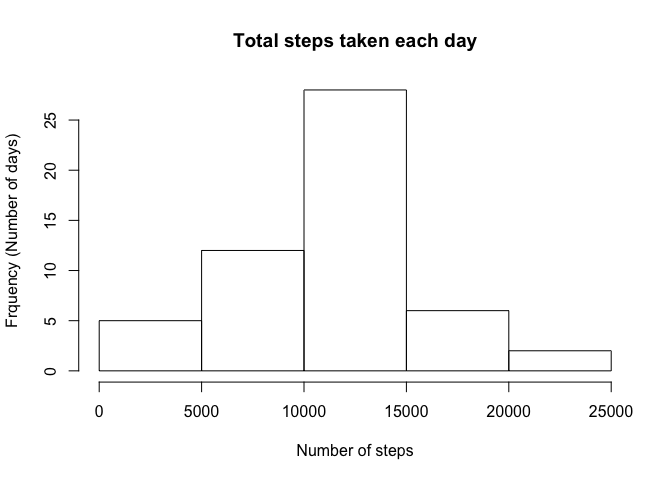
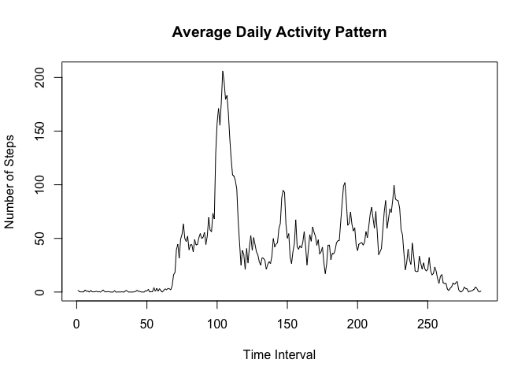
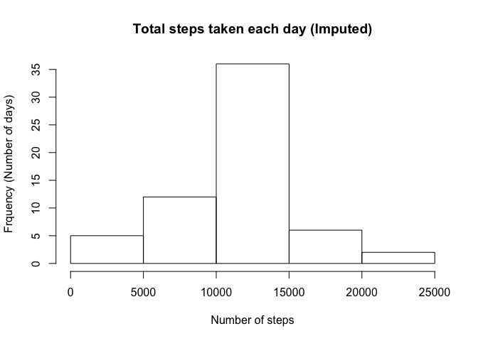
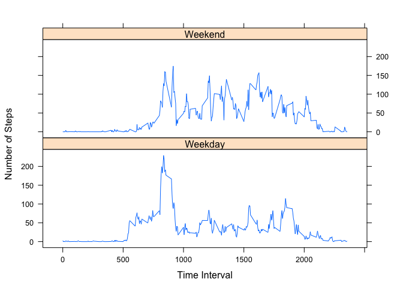

# Reproducible Research: Peer Assessment 1

## Loading and preprocessing the data


```r
library(lubridate)
library(datasets)
library(lattice)
library(dplyr)
```

```
## 
## Attaching package: 'dplyr'
## 
## The following objects are masked from 'package:lubridate':
## 
##     intersect, setdiff, union
## 
## The following object is masked from 'package:stats':
## 
##     filter
## 
## The following objects are masked from 'package:base':
## 
##     intersect, setdiff, setequal, union
```

```r
raw_data <- read.csv("activity.csv")  
raw_data$date <- ymd(raw_data$date)
```

## What is mean total number of steps taken per day?


```r
filter <- complete.cases(raw_data)
data <- raw_data[filter,]

data_by_date_grouped <- group_by(data, date)
data_by_date <- summarize(data_by_date_grouped, daily_total = sum(steps))

hist(data_by_date$daily_total, main = "Total steps taken each day", xlab = "Number of steps", ylab = "Frquency (Number of days)")
```

 

The mean number of steps taken per day:


```r
mean(data_by_date$daily_total)
```

```
## [1] 10766.19
```

The median number of steps taken per day:


```r
median(data_by_date$daily_total)
```

```
## [1] 10765
```

## What is the average daily activity pattern?


```r
data_by_interval_grouped <- group_by(data, interval)
data_by_interval <- summarize(data_by_interval_grouped, interval_average = mean(steps))

plot(data_by_interval$interval_average, type = "l", main = "Average Daily Activity Pattern", xlab = "Time Interval", ylab = "Number of Steps")
```

 

Time interval that has the most number of steps:


```r
data_by_interval$interval[which.max(data_by_interval$interval_average)]
```

```
## [1] 835
```

## Imputing missing values

Total number of missing values:


```r
sum(is.na(raw_data))
```

```
## [1] 2304
```

New dataset with missing values imputed, filling NAs with its respective 5-min interval mean:


```r
d <- data.frame(data_by_interval)
data_na <- raw_data[is.na(raw_data),]

count <- 1
for(i in data_na$interval){
  data_na[count,1] <- filter(d, interval == i)[,2]
	count <- count + 1
}

data_imputed <- rbind(data, data_na)

data_imputed_by_date_grouped <- group_by(data_imputed, date)
data_imputed_by_date <- summarize(data_imputed_by_date_grouped, daily_total = sum(steps))

hist(data_imputed_by_date$daily_total, main = "Total steps taken each day (Imputed)", xlab = "Number of steps", ylab = "Frquency (Number of days)")
```

 

The mean number of steps taken per day from imputed data:


```r
mean(data_imputed_by_date$daily_total)
```

```
## [1] 10766.19
```

The median number of steps taken per day from imputed data:


```r
median(data_imputed_by_date$daily_total)
```

```
## [1] 10766.19
```

The mean and median of the imputed data do not differ much from the data with NAs ignored. Thus, the impact of imputing missing data is small. 

## Are there differences in activity patterns between weekdays and weekends?


```r
for(j in 1:nrow(data_imputed)){
  if(weekdays(data[j,2]) %in% c("Saturday", "Sunday")){
		data_imputed[j,4] = "Weekend"
	}else{
		data_imputed[j,4] = "Weekday"
	}
}

names(data_imputed) <- c("steps", "date", "interval", "daytype")
data_imputed_by_interval_grouped <- group_by(data_imputed, interval, daytype)
data_imputed_by_interval <- summarize(data_imputed_by_interval_grouped, interval_average = mean(steps))

xyplot(interval_average ~ interval | daytype, data_imputed_by_interval, type = "l", layout = c(1, 2), xlab = "Time Interval", ylab = "Number of Steps")
```

 
